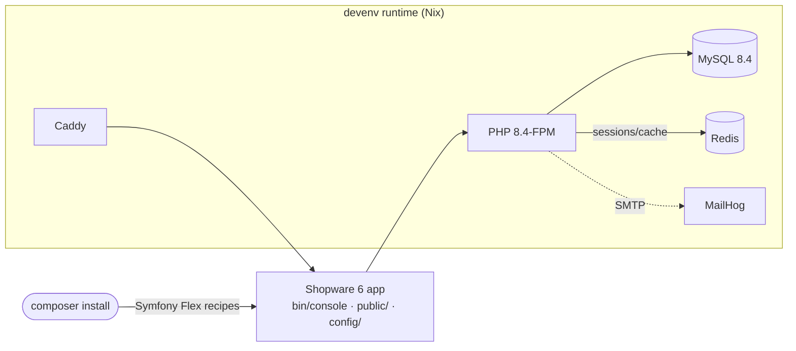

<div align="center">

# Shopware 6 devenv Template

**Docker-free, dev-speed-tuned local environment for Shopware 6 on Symfony Flex.**

[](https://www.php.net/)
[](https://www.shopware.com/)
[](https://devenv.sh)
[](https://dev.mysql.com/)
[](#license)

</div>

---

The **runtime** (PHP, Composer, Node, MySQL, Redis, MailHog, Caddy) is fully declared by
**[devenv](https://devenv.sh)** — no Docker, no VMs. The **project** itself is scaffolded by
**Symfony Flex** via a plain `composer install`. Setup runs through **devenv tasks**, which gives
clean, step-by-step CLI output instead of a hand-rolled install script.

> [!IMPORTANT]
> Open-source base only. The Shopware core packages are on Packagist — **no `auth.json` and no
> commercial license required** to get a running shop.

## At a glance

| | |
|---|---|
| **Stack** | PHP 8.4 (JIT + OPcache + APCu) · MySQL 8.4 · Redis · Caddy · Node 24 |
| **Provisioning** | Nix + devenv, activated automatically via direnv |
| **Scaffolding** | Symfony Flex (`composer install` generates `bin/console`, `public/`, `config/`, …) |
| **Shopware version** | `6.7.*` — single source of truth: `composer.json` → `shopware/core` |
| **Tuning philosophy** | Dev speed over durability — the DB is disposable, see [Performance tuning](#performance-tuning) |

## Architecture



Only the left-hand runtime and the Flex root (`composer.json`) are committed. Everything the
diagram shows inside `App` is generated on first `composer install` — see
[What's committed](#whats-committed).

## Quickstart

```bash
# 1) Activate the runtime (builds the devenv shell on first use)
direnv allow                     # or: devenv shell

# 2) Start the services — keep this shell open
devenv up                        # Caddy, MySQL, Redis, MailHog

# 3) In a second shell: install dependencies + Shopware, with progress
devenv tasks run shop:install
```

<details>
<summary><strong>What the install output looks like</strong></summary>

`shop:install` runs `shop:composer-install` first (Flex scaffolds the project and downloads
Shopware), then installs Shopware into the database:

```
• shop:composer-install   running…
✔ shop:composer-install   Succeeded   1m12s
✔ shop:install            Succeeded     38s
2 Succeeded  1m50s
```

</details>

The storefront is then live at `http://shopware-template.localhost`, admin at `/admin`
(`admin` / `shopware`).

### Tasks

| Task | What it does |
|---|---|
| `devenv tasks run shop:composer-install` | `composer install` — Flex scaffolds the skeleton |
| `devenv tasks run shop:install` | `system:install` — creates the DB + admin user |
| `devenv tasks run shop:build-js` | Builds Administration + Storefront assets (optional) |

Each task is idempotent: a `status` guard skips it once it has already run.

## What's committed

| File / folder | Purpose |
|---|---|
| `devenv.nix` | Runtime + installer tasks: PHP 8.4 (JIT/Xdebug/APCu), Node 24, MySQL 8.4 (dev-tuned), Redis, MailHog, Caddy |
| `devenv.yaml` | devenv inputs (`nixpkgs-unstable`, `froshpkgs` for `shopware-cli`) |
| `.envrc` | direnv → auto-loads the devenv shell |
| `composer.json` | Symfony-Flex root: `shopware/core` pinned, bundles follow via `*` |
| `.gitignore` | Ignores vendor, devenv artifacts, and everything Flex/Shopware generates |
| `custom/plugins/`, `custom/static-plugins/` | Local plugin development (wired as Composer `path` repositories) |

Everything else — `bin/console`, `public/index.php`, `config/bundles.php`, `src/Kernel.php`, … —
is generated by the Shopware/Symfony-Flex recipes during `composer install`.

## Versioning: single source of truth

> [!NOTE]
> Two independent knobs, each with exactly one place to change.

| What | Where | Detail |
|---|---|---|
| Shopware version | `composer.json` → `shopware/core` (`6.7.*`) | `administration`, `storefront`, `elasticsearch` follow via `*` — Composer resolves them against core's own constraints |
| Project domain | `devenv.nix` → `let project = "…"` | Feeds the Caddy vhost, `APP_URL`, and `CYPRESS_baseUrl` |

## Performance tuning

> [!WARNING]
> Durability is **deliberately traded for speed** throughout. This database is disposable and can
> be rebuilt in minutes with `devenv tasks run shop:install`. None of this belongs in production.

### Database (MySQL)

| Setting | Value | Effect |
|---|---|---|
| `innodb_buffer_pool_size` | `4G` (×4 instances) | Whole working set stays in RAM — default 128M makes migrations disk-bound |
| `innodb_redo_log_capacity` / `innodb_log_buffer_size` | `1G` / `64M` | Fewer checkpoints during write-heavy migrations |
| `innodb_flush_log_at_trx_commit` | `0` | No fsync on commit — biggest single speed lever for migrations/imports |
| `innodb_doublewrite` | `0` | No double-write protection — removes an entire duplicate write path |
| `innodb_flush_method` | `O_DIRECT_NO_FSYNC` | Skips the fsync syscall — tuned for NVMe/SSD |
| `innodb_flush_neighbors` | `0` | No neighbor-page flushing — irrelevant on SSD, only helps spinning disks |
| `table_open_cache` / `table_definition_cache` | `8000` / `4000` | Shopware ships hundreds of tables |
| `tmp_table_size` / `max_heap_table_size` / `join_buffer_size` | `512M` / `512M` / `256M` | Large joins & `GROUP BY` temp tables stay in memory |
| `performance_schema` | `0` | Skips bookkeeping that only matters at scale |
| `skip-log-bin` | `1` | Binary log off — no local replication/PITR needed |

<details>
<summary><strong>Why this is safe here but not in production</strong></summary>

Disabling `innodb_doublewrite` and relaxing `innodb_flush_log_at_trx_commit` doesn't make MySQL
write *more* to disk — it removes crash-recovery bookkeeping, so it actually **reduces** total
bytes written. The real trade-off is crash *consistency*, not disk wear: an OS crash or power
loss while these are disabled can corrupt the datadir. For a throwaway dev DB, the fix is
`devenv tasks run shop:install`. For production, none of this section applies.

</details>

`innodb_buffer_pool_size` is sized for a 31G-RAM dev machine. On smaller boxes, override it in a
gitignored `devenv.local.nix`:

```nix
services.mysql.settings.mysqld.innodb_buffer_pool_size = lib.mkForce "1G";
```

### PHP

| Setting | Value | Effect |
|---|---|---|
| `opcache.memory_consumption` | `512M` | Shopware alone ships >30k files |
| `opcache.max_accelerated_files` | `100000` | Headroom for core + bundles + plugins |
| `opcache.validate_timestamps` | `1` | Edited files are still picked up immediately — no manual cache clear in dev |
| `opcache.enable_cli` | `1` | `bin/console` benefits from the same cache |
| APCu extension | enabled | Backs `apcu-autoloader` — see below |
| FPM `pm` | `static`, 10 workers | Avoids the dynamic pool's warm-up latency after idle |
| `realpath_cache_size` | `8M` | Shopware's deep vendor tree benefits from a larger cache |

<details>
<summary><strong>Why APCu speeds up Composer's autoloader</strong></summary>

`apcu-autoloader` is already enabled in `composer.json`'s `config` block — it takes effect on
every `composer install`, no manual step needed.

OPcache and APCu cache two *different* things, not the same thing twice:

- **OPcache** caches *compiled bytecode* per file — it skips re-parsing/re-compiling PHP source.
- **APCu**, via `apcu-autoloader`, caches the *class name → file path* mapping Composer's
  autoloader otherwise resolves via PSR-4/classmap filesystem lookups on every request.

Shopware's autoloader has to resolve classes across `vendor/shopware/core`, `administration`,
`storefront`, `elasticsearch`, and every plugin in `custom/plugins/` — tens of thousands of
classes. APCu turns that lookup into a single shared-memory hit instead of a filesystem search,
and — because APCu is process-shared — the benefit persists across the short-lived PHP processes
spawned by every `bin/console` invocation, not just within one long-running FPM worker.

</details>

## Xdebug: fast by default, on when you need it

Xdebug is **off globally** (`xdebug.mode = off`), so every plain CLI call — console commands,
`composer` scripts, test runs — pays zero overhead. It's enabled selectively:

| Context | Mechanism | How to trigger |
|---|---|---|
| Web request | FPM pool sets `env[XDEBUG_MODE]=debug` | Browser's Xdebug helper extension (sets the `XDEBUG_SESSION` cookie) |
| CLI | `debug-console` devenv script | `debug-console bin/console some:command` |

> [!TIP]
> `debug-console` is equivalent to `XDEBUG_MODE=debug XDEBUG_TRIGGER=1 php bin/console some:command`
> — use whichever is more convenient. `xdebug.start_with_request = trigger` means neither path
> costs anything until it's actually triggered.

PhpStorm: configure the debug port as `9003` (default) and start listening as usual — both paths
above connect to it.

## Handy to know

- **Mail:** MailHog UI at `http://localhost:8025` (SMTP `localhost:1025`; `MAILER_DSN` is preset).
- **Background workers:** `queue-worker` and `scheduled-task-runner` are commented out in
  `devenv.nix` — enable them once the shop is installed.
- Run all `bin/console` / `composer` commands inside the devenv shell.

## Adding commercial Store plugins later

This template is an open-source base. To pull in commercial Shopware Store plugins:

1. Add an `auth.json` with your Composer token for `packages.shopware.com`.
2. Add the `https://packages.shopware.com` entry to `repositories` in `composer.json`, then
   `composer require <vendor>/<plugin>`.

## License

MIT — this template. Shopware itself is dual-licensed; see the
[Shopware license](https://github.com/shopware/shopware/blob/trunk/LICENSE).
